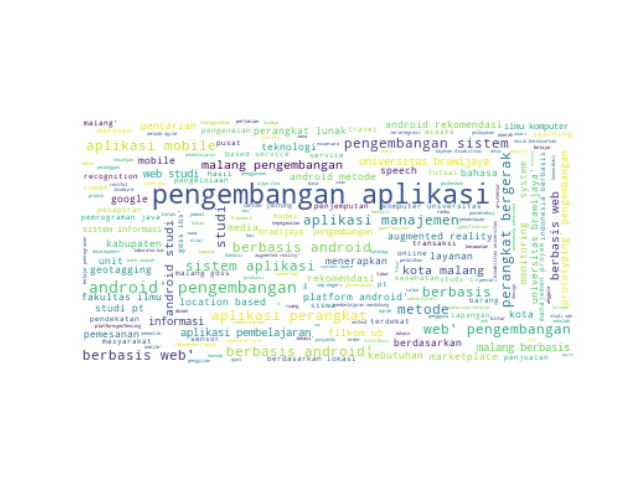

# Document Clustering System for Thesis Document Informatics Student
> This repository is my project during my internship at the Laboratory of Technology Enhanced Learning, Faculty of Computer Science, Brawijaya University. This is a document clustering system used to grouping student thesis documents from informatics engineering.

## Table of contents
* [General info](#general-info)
* [Screenshots](#screenshots)
* [Package](#package)
* [Setup](#setup)
* [Inspiration](#inspiration)
* [Contact](#contact)

## General info
Add more general information about project. What the purpose of the project is? Motivation?

## Screenshots

## Package
* <a href="https://numpy.org/">Numpy</a>
* <a href="https://pandas.pydata.org/">Pandas</a>
* <a href="https://matplotlib.org/">Matplotlib</a>
* <a href="https://pypi.org/project/PySastrawi/">PySastrawi</a>
* <a href="https://pypi.org/project/wordcloud/">WordCloud</a>
* <a href="https://scikit-learn.org/">SKLearn</a>

## Setup
1. If you haven't installed the packages above, please install them first.
2. Run at main.py

## Inspiration
Add here credits. Project inspired by..., based on...

## Author
* [Adhi Setiawan](https://www.linkedin.com/in/adhiisetiawan) 
* [Giffaro Nandra Ridhoaldi](https://www.linkedin.com/in/giffaro-nandra-ridhoaldi-0469b71b5/)
