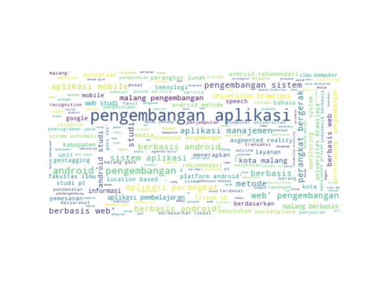
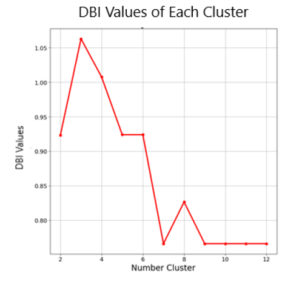

# Document Clustering System for Thesis Document Informatics Student
> This repository is my project during my internship at the Laboratory of Technology Enhanced Learning, Faculty of Computer Science, Brawijaya University. This is a document clustering system used to grouping student thesis documents from informatics engineering.

## Table of contents
* [General info](#general-info)
* [Screenshots](#screenshots)
* [Package](#package)
* [Setup](#setup)
* [Contact](#contact)

## General info
Research is a compulsory thing that must be conducted by students to obtain a  degree including bachelor. The concrete result of research conducted by students is required for graduation which usually called thesis. Every year  students successfully graduated and obtained a bachelor's degree. therefore, the number of existing thesis documents will increase by the time. The increasing number of thesis documents will make it more difficult to search and manage if they are not well organized. Based on these problems, the development of a document clustering system will help the existing thesis document management process. By carrying out the document clustering process, a large number of thesis documents can be categorized into several types based on similarity in titles. It would help in classifying or labeling of the documents easier. The method that will be used in the document clustering process of this thesis is Self Organizing Maps.

## Screenshots
Example document from in cluster 5

DBI Values

## Package
* <a href="https://numpy.org/">Numpy</a>
* <a href="https://pandas.pydata.org/">Pandas</a>
* <a href="https://matplotlib.org/">Matplotlib</a>
* <a href="https://pypi.org/project/PySastrawi/">PySastrawi</a>
* <a href="https://pypi.org/project/wordcloud/">WordCloud</a>
* <a href="https://scikit-learn.org/">SKLearn</a>

## Setup
1. If you haven't installed the packages above, please install them first.
2. Run at main.py

## Author
* [Adhi Setiawan](https://www.linkedin.com/in/adhiisetiawan) 
* [Giffaro Nandra Ridhoaldi](https://www.linkedin.com/in/giffaro-nandra-ridhoaldi-0469b71b5/)
